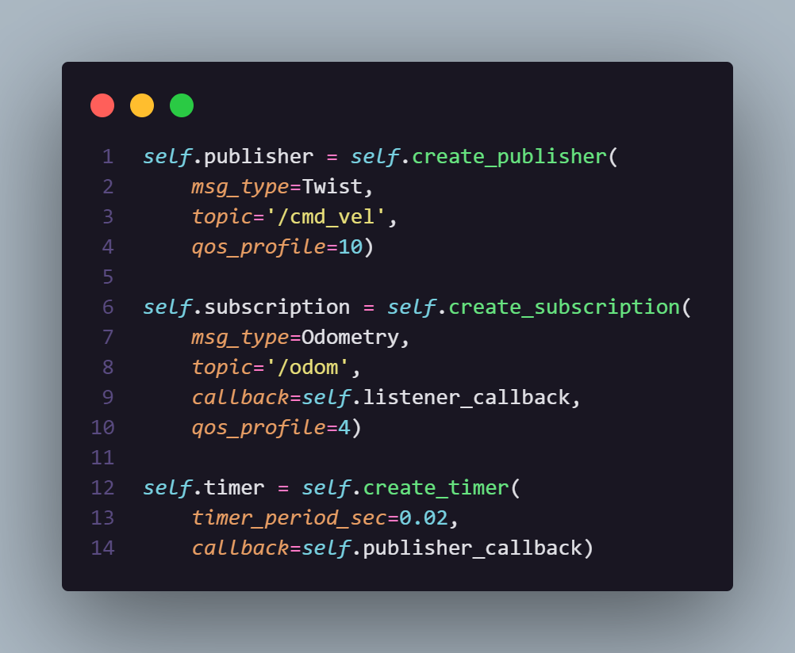
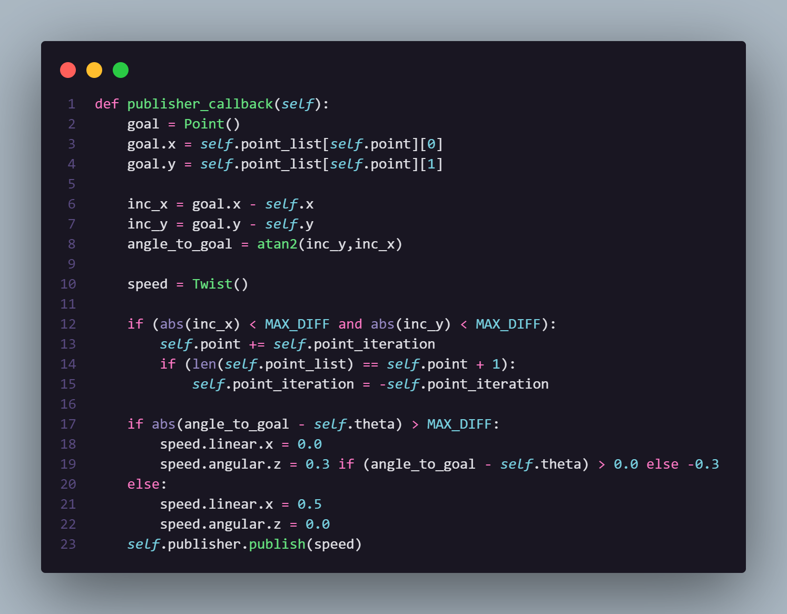

# Atividade 2: Simulação de robôs móveis com Gazebo:

## Enunciado
Crie um pacote em ROS capaz de interagir com uma simulação feita no Gazebo de modo que a plataforma simulada do turtlebot3 seja capaz de mover-se de maneira controlada.

* Interagir com os tópicos e/ou serviços do turtlebot3 de modo a conseguir mandar comandos de velocidade e extrair dados de odometria.
* Conceber uma estrutura de dados capaz de armazenar a série de movimentos que devem ser feitos pelo robô para chegar no objetivo.
* Implementar uma rota pré-estabelecida

## Vídeo de demonstração
https://github.com/Lukovsk/entregas-M6/assets/99260684/2486cb9d-4f1c-4a2e-a4b7-f2521ea8424f

## Interação com os tópicos relacionados ao robô simulado

Aqui, a interação com os tópicos do turtlebot está justamente nesses primeiros dois objetos (linhas 1 e 6).

Na linha 1, é instanciado um *publisher* que é usado para enviar mensagens de mudança de velocidade para o tópico ```'/cmd_vel'``` (seja linear em x ou angular em z), como explicado a frente em Implementação. 

Na linha 6, é instanciado um *subscriber* que é usado para receber a posição do robô do tópico ```'/odom'``` e calcular a distância até o próximo ponto que ele deve ir. 

## Implementação


Aqui está a implementação do uso dos tópicos explicados anteriormente para a movimentação do turtlebot. Nas primeiras linhas (1 a 8) é calculado o ângulo entre o robô e o próximo ponto que ele deve ir. Nesse caso, ele gira em torno do próximo eixo em busca de colocar seu eixo x de frente para o próximo ponto, toda vez que ele sai desse eixo por um parâmetro de tolerância, ele para e procura novamente o ângulo certo para seguir. Por fim, quando ele completa a lista de pontos (ou seja, termina seu trajeto), é indicado que ele retorne ao ponto inicial. 