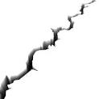
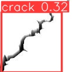
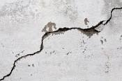
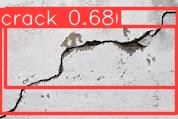

# Atividade 3: Processamento de imagens e detecção de objetos

## Enunciado
Desenvolva um script em Python capaz de identificar rachaduras em paredes de concreto. Utilize o dataset desenvolvido pela Roboflow. Para o desenvolvimento dessa atividade, recomenda-se o uso de um modelo de detecção de objetos pré-treinado, como o YoLo.

## Vídeo de demonstração

https://github.com/Lukovsk/entregas-M6/assets/99260684/2065271d-6fd0-4c27-9188-1912ac9c6fb0

## Implementação
No notebook ipynb deste repositório, encontra-se um script capaz de identificar rachadures em paredes de concreto. É utilizada a biblioteca `Roboflow` para a criação do dataset necessário e, com o modelo de detecção de objetos pré-treinado, o `YoLo`, esse dataset é utilizado para treinar o modelo. Por fim, foram inseridas duas imagens com rachaduras e o modelo executa a detecção de rachaduras neles. Assim como o vídeo e as imagens abaixo, é possível ver que as rachaduras são identificadas com sucesso.

    

        
        
    

    

        
        
    

